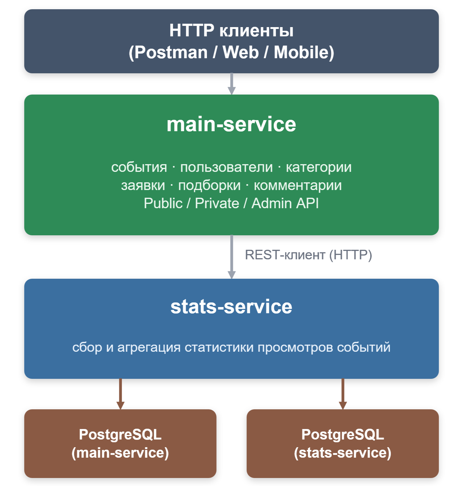

# 🗺️ ExploreWithMe — платформа для афиш и совместных событий


[](https://openjdk.org/)
[](https://spring.io/projects/spring-boot)
[](https://maven.apache.org/)
[](https://www.postgresql.org/)
[](https://www.docker.com/)
[](https://checkstyle.sourceforge.io/)
[](https://spotbugs.github.io/)
[](https://www.jacoco.org/jacoco/)

---
## 💡 О проекте

Backend-платформа на **Java 21 / Spring Boot 3**, которая позволяет пользователям публиковать события (концерты, встречи, лекции, спортивные активности), находить компанию для участия и управлять всем этим через REST API. Проект построен по принципам микросервисной архитектуры с изоляцией бизнес-логики и статистики в отдельные сервисы.

Проект спроектирован как два независимых Spring Boot приложения, разворачиваемых в отдельных Docker-контейнерах и общающихся между собой по HTTP.

---
## 🏗️ Архитектура


 
- **`main-service`** — основной сервис: пользователи, события, категории, подборки, заявки на участие, комментарии. Реализует три уровня API (`public`, `private`, `admin`) с разной логикой доступа и валидации.
- **`stats`** — независимый сервис статистики. Фиксирует каждое обращение к эндпоинтам событий и предоставляет агрегированные данные (например, количество просмотров) по HTTP-контракту, описанному в собственной OpenAPI-спецификации.
- Сервисы полностью изолированы: у каждого своя база данных, свой Docker-контейнер, свой жизненный цикл — `stats` можно переиспользовать в другом проекте без изменений.
- Взаимодействие между сервисами — через HTTP-клиент, без прямого доступа к чужой БД.

---

## ⚙️ Технологический стек

| Категория | Технологии |
|---|---|
| Язык / платформа | Java 21, Spring Boot 3.3.2 |
| Web | Spring Web (REST), Spring MVC |
| Данные | Spring Data JPA, Hibernate, PostgreSQL |
| Валидация | Bean Validation (JSR-380) |
| Сборка | Maven (multi-module) |
| Контейнеризация | Docker, Docker Compose |
| Контроль качества | Checkstyle, SpotBugs, JaCoCo (проверка покрытия тестами прямо в сборке) |
| Тестирование API | Postman-коллекции, JSON-контракты OpenAPI |
| Прочее | Lombok, MapStruct-подход к DTO-мапперам |

---

## 🚀 Ключевые возможности

- **Управление событиями**: создание, редактирование, публикация/отклонение (модерация администратором), фильтрация по категориям, датам, статусу.
- **Заявки на участие**: подтверждение/отклонение владельцем события, лимит участников, приватные и публичные модерируемые события.
- **Подборки событий (compilations)**: тематические под для главной страницы.
- **Комментарии к событиям**: пользователи могут оставлять, редактировать и удалять комментарии; администратор может модерировать любой комментарий. Реализовано по тем же принципам трёхуровневого API (`public / private / admin`), что и остальной функционал.
- **Статистика просмотров**: подсчёт уникальных обращений к событиям через отдельный сервис — данные используются для сортировки «популярное сейчас».
- **Валидация бизнес-правил**: даты событий, состояния заявок, права владения ресурсом — всё проверяется на уровне сервисного слоя, а не только аннотациями.

---

## 📡 Пример API (модуль «Комментарии»)

| Метод | Эндпоинт | Доступ | Описание |
|---|---|---|---|
| `GET` | `/comments/event/{eventId}` | Public | Список комментариев к событию |
| `GET` | `/comments/user/{authorId}` | Admin | Все комментарии пользователя |
| `DELETE` | `/comments/{commentId}` | Admin | Удаление комментария (модерация) |
| `POST` | `/comments/{authorId}/{eventId}` | Private | Создать комментарий |
| `PATCH` | `/comments/{authorId}/{commentId}` | Private | Отредактировать свой комментарий |
| `DELETE` | `/comments/{authorId}/{commentId}` | Private | Удалить свой комментарий |

Полная OpenAPI-спецификация для основного сервиса и сервиса статистики лежит в файлах [`ewm-main-service-spec.json`](./ewm-main-service-spec.json) и [`ewm-stats-service-spec.json`](./ewm-stats-service-spec.json), а готовые сценарии проверки — в папке [`postman`](./postman).

---

## ▶️ Запуск проекта

```bash
# Клонировать репозиторий
git clone https://github.com/ChumakovPaul/java-explore-with-me.git
cd java-explore-with-me

# Собрать оба модуля
mvn clean package

# Поднять всё окружение (main-service + stats + PostgreSQL) одной командой
docker-compose up -d
```

После запуска:
- `main-service` — доступен на порту, указанном в `docker-compose.yml`;
- `stats` — поднимается как отдельный сервис со своей БД;
- Postman-коллекции из папки `postman` позволяют сразу проверить все сценарии.
---

## 👤 Автор

**Павел Чумаков**
Backend-разработчик на Java / Spring
GitHub: [@ChumakovPaul](https://github.com/ChumakovPaul)
